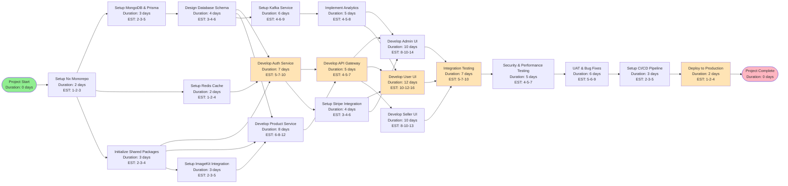

# PERT Chart - E-Commerce Microservices Platform

## Project Scenario
Development and deployment of a full-stack e-commerce platform with microservices architecture, including seller dashboard, customer storefront, authentication, product management, payment processing, and analytics.

## PERT Diagram

## Task Breakdown with Time Estimates

| Task ID | Task Name | Optimistic (days) | Most Likely (days) | Pessimistic (days) | Expected Time (days) |
|---------|-----------|-------------------|--------------------|--------------------|---------------------|
| A | Setup Nx Monorepo | 1 | 2 | 3 | 2.0 |
| B | Setup MongoDB & Prisma | 2 | 3 | 5 | 3.2 |
| C | Setup Redis Cache | 1 | 2 | 4 | 2.2 |
| D | Initialize Shared Packages | 2 | 3 | 4 | 3.0 |
| E | Design Database Schema | 3 | 4 | 6 | 4.2 |
| F | Develop Auth Service | 5 | 7 | 10 | 7.2 |
| G | Develop Product Service | 6 | 8 | 12 | 8.3 |
| H | Develop API Gateway | 4 | 5 | 7 | 5.2 |
| I | Setup Kafka Service | 4 | 6 | 9 | 6.2 |
| J | Implement Analytics | 4 | 5 | 8 | 5.3 |
| K | Setup ImageKit Integration | 2 | 3 | 5 | 3.2 |
| L | Setup Stripe Integration | 3 | 4 | 6 | 4.2 |
| M | Develop Admin UI | 8 | 10 | 14 | 10.3 |
| N | Develop User UI | 10 | 12 | 16 | 12.3 |
| O | Develop Seller UI | 8 | 10 | 13 | 10.2 |
| P | Integration Testing | 5 | 7 | 10 | 7.2 |
| Q | Security & Performance Testing | 4 | 5 | 7 | 5.2 |
| R | UAT & Bug Fixes | 5 | 6 | 9 | 6.3 |
| S | Setup CI/CD Pipeline | 2 | 3 | 5 | 3.2 |
| T | Deploy to Production | 1 | 2 | 4 | 2.2 |

**Total Expected Duration**: ~110 days (approx. 22 weeks or 5.5 months)

## Critical Path

The critical path (longest path determining minimum project duration):

**Start → A → B → E → G → H → N → P → Q → R → S → T → End**

Tasks on critical path (marked in orange in diagram):
1. Design Database Schema (E)
2. Develop Auth Service (F)
3. Develop API Gateway (H)
4. Develop User UI (N)
5. Integration Testing (P)
6. Deploy to Production (T)

## Key Dependencies

1. **Database Schema** must be completed before any service development
2. **Auth Service** is prerequisite for API Gateway
3. **API Gateway** must be ready before frontend development
4. **All UIs** must be completed before integration testing
5. **Kafka/Analytics** runs parallel but must complete before frontend integration

## Risk Factors

- User UI has longest duration (12.3 days) - on critical path
- Multiple dependencies on Auth Service and API Gateway
- Integration testing requires all components ready
- ImageKit and Stripe integrations could cause delays if API issues occur

## Notes

- EST format: Optimistic-MostLikely-Pessimistic
- Expected Time calculated using: (O + 4M + P) / 6
- Highlighted tasks (orange) indicate critical path
- Green = Start, Pink = End
